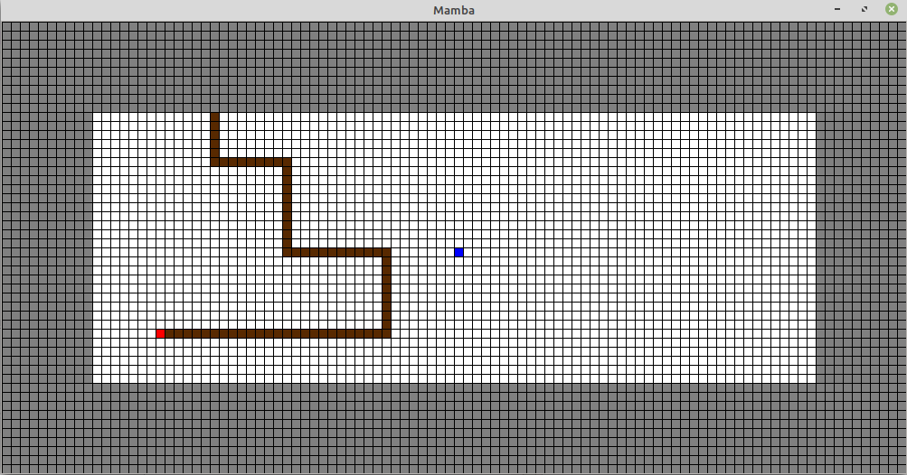
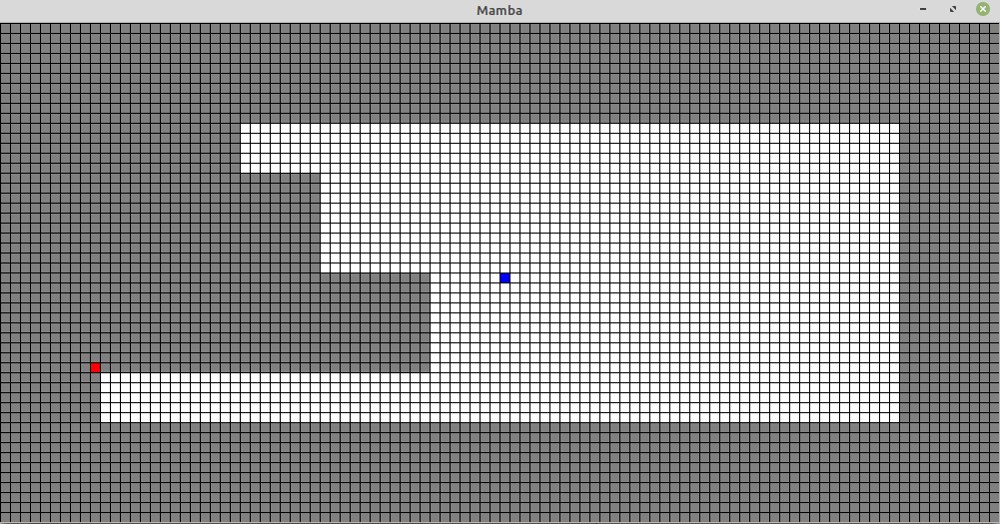

# Mamba Game

This repository implements the Mamba game with PyQt5, which was developed during an academic project.
Mamba is an asymetric game where a Snake and a Monster fight for control over a territory.

 

The Snake (in red) can hide in its own area (grey cells) and can capture a part of the Monster territory (white cells)
by closing a path (brown cells) inside it. However when doing so, the Snake is vunerable and the Monster can kill the Snake
by breaking the path before it closes.
The objective of the Snake is to capture as much land as possible before the Monster stops it.
Both the Snake and the Monster can be played by humans or AIs of different levels.

To play the game, clone the repository and launch Demos.py. Instructions are given inside the file.
